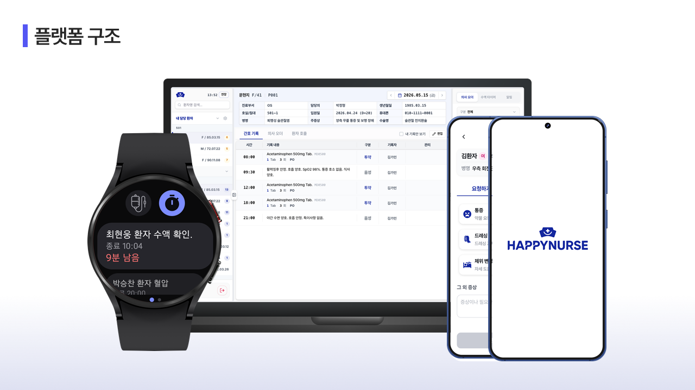
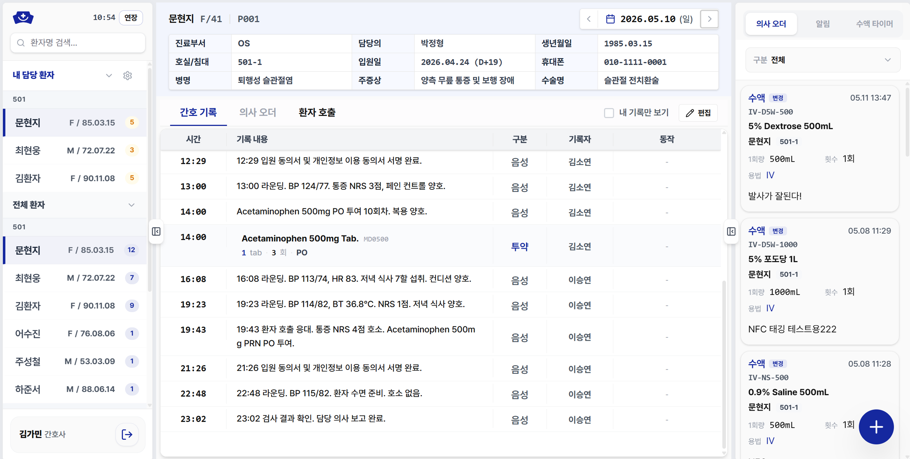
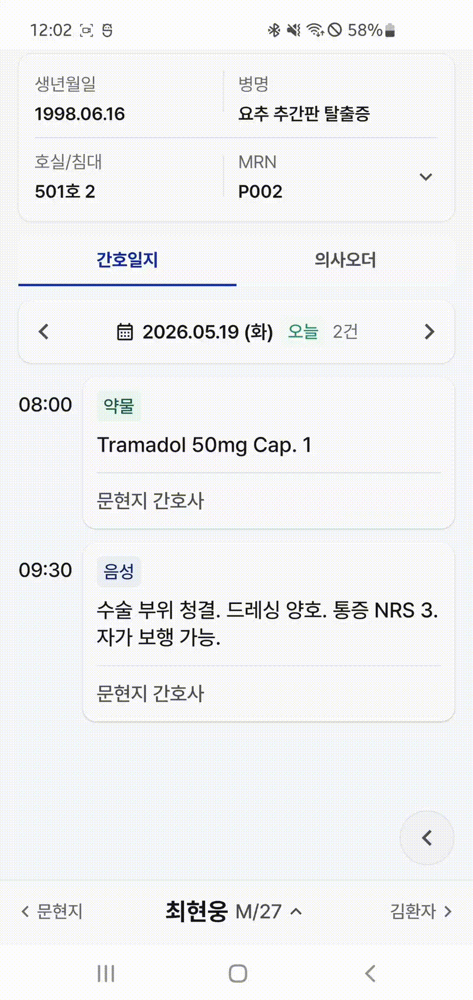
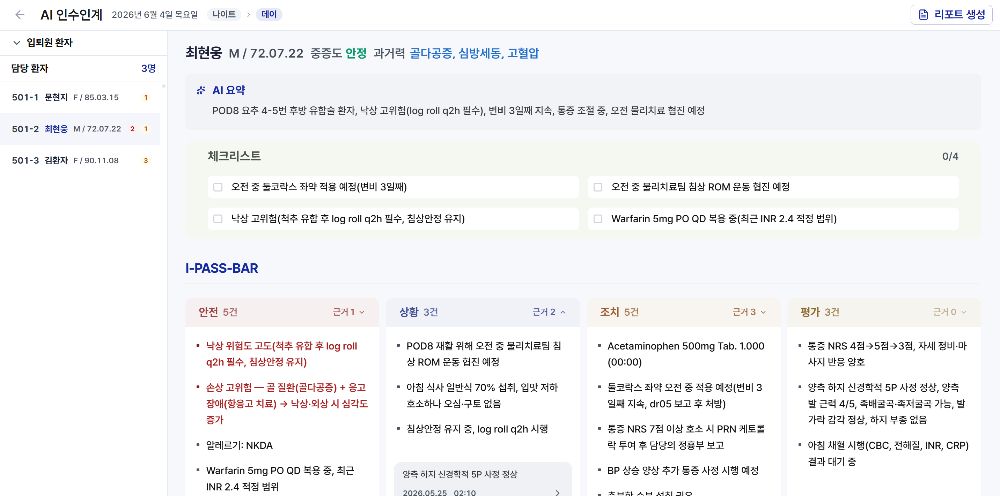
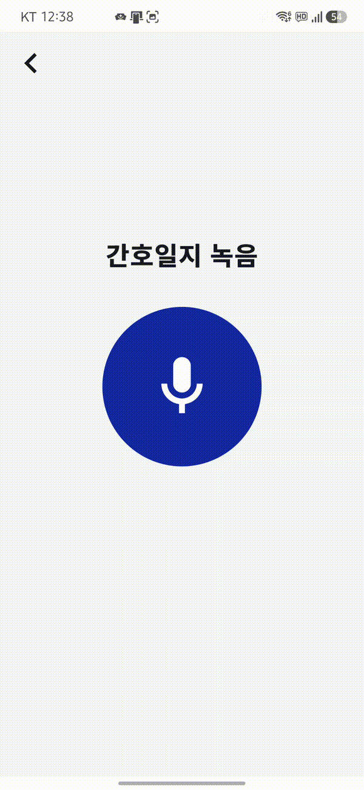
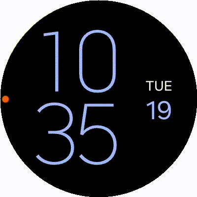
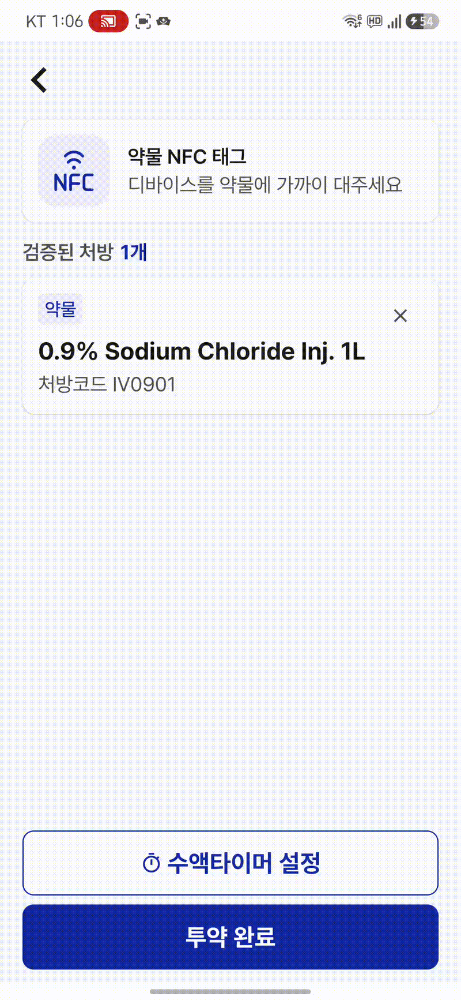
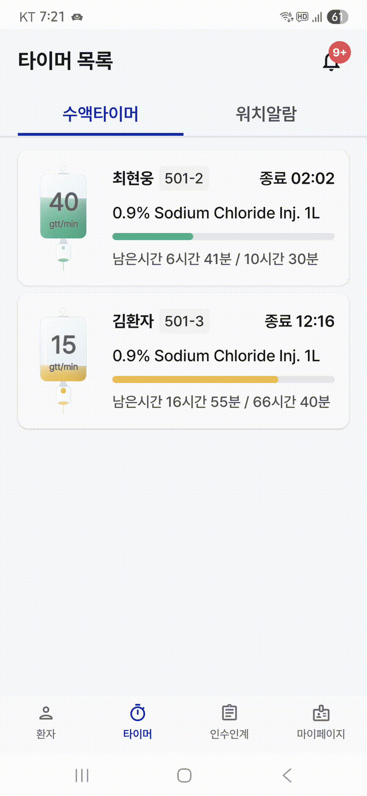
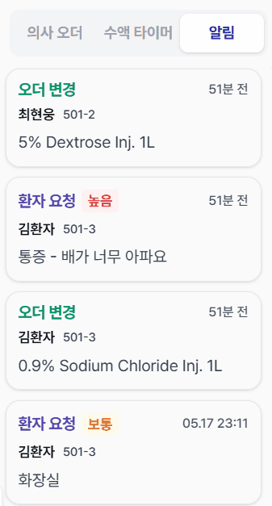
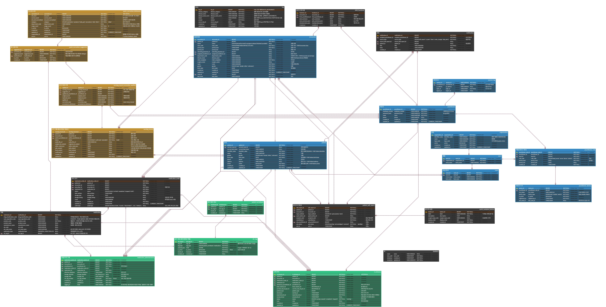

<div align="center">

<!-- 로고/배너 이미지 영역 -->
<!-- 여기에 프로젝트 로고 또는 배너 이미지를 넣어주세요 -->


# HappyNurse

---

### 🏆 SSAFY 자율 프로젝트 우수상 수상

### 기록은 HappyNurse가, 케어는 간호사가

### 간호사를 위한 업무 자동화 AI 에이전트 비서

<br/>


<br/>

### SSAFY 자율 프로젝트 · 6인 팀 · 8주 진행

### 개발 기간 : 2026.04.14 ~ 2026.05.22

### 플랫폼: Web & Android App & Watch App

</div>

<br/>

## 📑 목차

<h3>1. <a href="#1-프로젝트-소개">프로젝트 소개</a></h3>
<h3>2. <a href="#2-기획-배경">기획 배경</a></h3>
<h3>3. <a href="#3-주요-기능">주요 기능</a></h3>
<h3>4. <a href="#4-팀원-소개">팀원 소개</a></h3>
<h3>5. <a href="#5-기술-스택">기술 스택</a></h3>
<h3>6. <a href="#6-시스템-아키텍처">시스템 아키텍처</a></h3>
<h3>7. <a href="#7-erd">ERD</a></h3>
<h3>8. <a href="#8-프로젝트-구조">프로젝트 구조</a></h3>
<h3>9. <a href="#9-산출물">산출물</a></h3>

<br/>

<a id="1-프로젝트-소개"></a>

## 🏥 1. 프로젝트 소개

**HappyNurse(해피너스)**는 병동 간호사의 반복적인 기록 업무를 자동화하여, 간호사가 본질적인 환자 케어에 집중할 수 있도록 돕는 **AI 업무 자동화 비서**입니다.

NFC 태깅으로 환자와 약물을 즉시 인식하고, 음성(STT)으로 간호 기록을 작성하며, AI가 인수인계 내용을 자동 요약합니다. 모바일 앱·스마트워치·웹 관리 콘솔이 유기적으로 연동되어, 침상에서의 실시간 기록부터 데스크탑에서의 검토·확정까지 하나의 흐름으로 이어집니다.

<!-- 프로젝트 대표 GIF 또는 메인 화면 이미지 영역 -->
<!-- 여기에 프로젝트 전체를 보여주는 대표 GIF를 넣어주세요 -->
<div align="center">

</div>

<br/>

<a id="2-기획-배경"></a>

## 💡 2. 기획 배경

간호사는 환자 케어보다 기록·행정 업무에 많은 시간을 소모합니다. 투약 기록, 간호일지 작성, 인수인계 정리 등 반복적인 문서 작업은 간호사의 피로도를 높이고 환자와의 접점을 줄입니다.

HappyNurse는 다음 문제를 해결하고자 합니다.

- **기록 부담 경감** - 음성 한 번으로 간호일지를 작성하고, AI가 의료 용어를 교정합니다.
- **투약 안전성 강화** - NFC 환자 팔찌·약물 태그를 검증하여 오투약을 방지합니다.
- **인수인계 누락 방지** - AI가 근무 중 발생한 특이사항을 자동 요약해 인수인계 품질을 높입니다.
- **실시간 알림** - 수액 잔량, 환자 호출, 처방 변경 등을 워치·앱으로 즉시 전달합니다.

<br/>

<a id="3-주요-기능"></a>

## ✨ 3. 주요 기능

### 환자 정보 조회 & 의사 오더 확인

<p align="center">병동·호수별 환자 리스트를 조회하고, 환자별 간호일지와 의사 오더(투약·수액·처치·검사·영상)를 타임라인으로 확인합니다.</p>

<!-- 기능 시연 GIF 영역 -->
<div align="center">
  
  
</div>

<br/>

### AI 인수인계 자동 요약

<p align="center">근무 중 발생한 V/S 이상, 미완료 업무, 신규 처방 등을 AI가 자동으로 요약하여 인수인계 카드로 제공합니다. 주의사항과 인수자 체크리스트를 함께 정리합니다.</p>

<!-- 기능 시연 GIF 영역 -->
<div align="center">
  
  
</div>

<br/>

### 음성(STT) 간호일지 작성

<p align="center">음성으로 간호 기록을 녹음하면 STT로 자동 변환되고, AI 교정 사전이 의료 용어 오인식을 보정합니다. 작성된 기록은 웹으로 전송되어 검토 후 확정됩니다.</p>

<!-- 기능 시연 GIF 영역 -->
<div align="center">
  
  
</div>

<br/>

### NFC 기반 환자·약물 인식

<p align="center">환자 팔찌를 태깅하면 환자 정보가 즉시 표시되고, 약물 NFC 태그로 투약 내역을 검증·기록합니다.</p>

<!-- 기능 시연 GIF 영역 -->
<div align="center">
  
  
</div>

<br/>

### 수액 타이머

<p align="center">간호 알람과 수액 타이머를 통합 관리합니다. 수액 주입 속도를 입력하면 종료 예정 시각을 자동 계산하고, 잔량 임계치 도달 시 앱·워치로 알림을 보냅니다.</p>

<!-- 기능 시연 GIF 영역 -->
<div align="center">
  
  
</div>

<br/>

### 실시간 알림

<p align="center">환자 호출, 처방 변경, 투약 시각 등 주요 이벤트를 앱·워치로 즉시 전달합니다. FCM 푸시와 SSE 스트리밍을 결합해 알림 지연을 최소화합니다.</p>

<!-- 기능 시연 GIF 영역 -->
<div align="center">
  
  
  
</div>

<br/>

### 워치 제스처

<p align="center">양손이 자유롭지 못한 간호 업무 중에도 손목 제스처로 타이머를 설정할 수 있습니다.</p>

<!-- 기능 시연 GIF 영역 -->
<div align="center">
  
</div>

<br/>

<a id="4-팀원-소개"></a>

## 👥 4. 팀원 소개

<div align="center">

<center>
  <table align="center" width="100%">
      <tr>
          <td width="33%" align="center">
              
              <br/> 김가민 (Leader) <br/>(Infra & AI)
          </td>
          <td width="33%" align="center">
              
              <br/> 김소연 <br/>(Backend & Database)
          </td>
          <td width="33%" align="center">
              
              <br/> 문현지 <br/>(Frontend & Design)
          </td>
      </tr>
      <tr>
          <td width="33%">
              <sub>
                  - AI CLOVA STT 파이프라인 (노이즈 제거, 용어 매핑)<br/>
                  - STT 타이머 알림 (BE + FCM)<br/>
                  - Jenkins CI/CD 파이프라인 구축<br/>
                  - Blue-Green 무중단 배포<br/>
                  - Mattermost 배포 알림
              </sub>
          </td>
          <td width="33%">
              <sub>
                  - 앱 로그인 API 및 리프레시 토큰<br/>
                  - IV 수액 타이머 서비스 (ml→gtt 환산)<br/>
                  - 인수인계 체크리스트 API<br/>
                  - 입퇴원 환자 조회 API
              </sub>
          </td>
          <td width="33%">
              <sub>
                  - Android 앱 전체 UI/UX 구현<br/>
                  - Wear OS 워치 앱 (제스처, 간호기록 STT)<br/>
                  - FCM 푸시 알림 및 SSE 실시간 연동<br/>
                  - 워치 환자 긴급 알림 화면<br/>
                  - 앱 NFC 환자 인증 화면
              </sub>
          </td>
      </tr>
  </table>
</center>

<center>
  <table align="center" width="100%">
      <tr>
          <td width="33%" align="center">
              
              <br/> 박승찬 <br/>(Backend & AI)
          </td>
          <td width="33%" align="center">
              
              <br/> 이승연 <br/>(Backend & Design)
          </td>
          <td width="33%" align="center">
              
              <br/> 최현웅 <br/>(Frontend & AI)
          </td>
      </tr>
      <tr>
          <td width="33%">
              <sub>
                  - SSE 실시간 알림 시스템 전체 설계·구현<br/>
                  - NFC 환자 웹앱 본인확인 API<br/>
                  - IV 수액 SSE 연동<br/>
                  - AI 인수인계 PASS-BAR 리포트 개발
              </sub>
          </td>
          <td width="33%">
              <sub>
                  - Spring Security + JWT 인증 시스템 설계<br/>
                  - Redis 리프레시 토큰 구현<br/>
                  - 로그인/로그아웃/회원가입 API<br/>
                  - AI 환자 증상 LLM 중요도 분류 서비스
              </sub>
          </td>
          <td width="33%">
              <sub>
                  - 웹 대시보드 EMR UI · 비즈니스 로직 전반<br/>
                  - 웹 AI 인수인계 PASS-BAR 리포트 화면 · 통합 요약<br/>
                  - 웹 SSE 실시간 구독<br/>
                  - NFC 토큰 환자 본인확인 웹앱<br/>&nbsp;&nbsp;+ 환자 음성 STT 통합 (AI + BE + FE)<br/>
                  - 환자 호출 비속어 필터링<br/>&nbsp;&nbsp;(AI 엔드포인트 + BE 정제 흐름 + FE 연동)<br/>
                  - 앱 NFC 환자·약물 인식 · 음성 메모 STT<br/>&nbsp;&nbsp;· 수액 타이머/속도 계산 · 약물 등록 FE 구현
              </sub>
          </td>
      </tr>
  </table>
</center>

</div>

<br/>

<a id="5-기술-스택"></a>

## 🛠️ 5. 기술 스택

<details>
<summary><b>Frontend - 앱 / 워치</b></summary>

| 구분        | 기술                                        |
| ----------- | ------------------------------------------- |
| 언어        | Kotlin 2.2.20 (compileSdk 35)               |
| UI          | Jetpack Compose (Material 3)                |
| 의존성 주입 | Hilt                                        |
| 비동기      | Kotlin Coroutines                           |
| 네트워크    | Retrofit, OkHttp                            |
| 직렬화      | Kotlinx Serialization                       |
| 화면 전환   | Navigation Compose                          |
| 로컬 저장   | DataStore                                   |
| 이미지 로딩 | Coil                                        |
| 워치 연동   | Wear OS Data Layer                          |
| 디바이스    | NFC, Firebase Cloud Messaging               |

</details>

<details>
<summary><b>Frontend - 웹</b></summary>

| 구분       | 기술                                                  |
| ---------- | ----------------------------------------------------- |
| 프레임워크 | Next.js 16, React 19                                  |
| 언어       | TypeScript 5                                          |
| 상태 관리  | TanStack Query, Zustand                               |
| 스타일     | Tailwind CSS 4, shadcn/ui, Radix UI                   |
| 폼         | React Hook Form                                       |
| 네트워크   | Axios                                                 |
| 시각화     | Recharts                                              |
| 기타       | Framer Motion, lucide-react, date-fns, sonner         |

</details>

<details>
<summary><b>Backend</b></summary>

| 구분           | 기술                           |
| -------------- | ------------------------------ |
| 프레임워크     | Spring Boot 3                  |
| 언어           | Java 17                        |
| 데이터 접근    | Spring Data JPA                |
| 캐시           | Redis                         |
| 인증/인가      | Spring Security, JWT            |
| API 문서       | SpringDoc OpenAPI (Swagger UI) |
| 푸시           | Firebase Admin SDK (FCM)       |
| 분산 스케줄 락 | ShedLock                       |
| 모니터링       | Spring Boot Actuator           |

</details>

<details>
<summary><b>AI</b></summary>

| 구분            | 기술                                                                |
| --------------- | ------------------------------------------------------------------- |
| 프레임워크      | FastAPI, Uvicorn (Python 3.12)                                      |
| 음성 인식 (STT) | Naver CLOVA Speech                                                  |
| 형태소 분석     | Kiwi                                                              |
| 의료 용어 교정  | RapidFuzz (퍼지 매칭 기반 용어 사전 매핑)                           |
| LLM             | Claude Haiku (발화 분류 · 욕설 필터), Claude Sonnet (인수인계 요약) |
| 스트리밍        | SSE (sse-starlette)                                                 |
| DB 연동         | SQLAlchemy, asyncpg / psycopg2                                      |

</details>

<details>
<summary><b>Database & Infrastructure</b></summary>

**Database**

| 구분  | 기술          |
| ----- | ------------- |
| RDBMS | PostgreSQL 17 |
| 캐시  | Redis         |

**Infrastructure**

| 구분          | 기술                                          |
| ------------- | --------------------------------------------- |
| CI/CD         | Jenkins (Build → Deploy → Image Prune)        |
| 컨테이너      | Docker, Docker Compose                        |
| 배포 전략     | Blue-Green 무중단 배포 (dev / prod 환경 분리) |
| 리버스 프록시 | Nginx (upstream 전환)                         |
| 형상 관리     | GitLab                                        |
| 알림          | Mattermost (빌드 / 배포 결과 통지)            |

</details>

<br/>

<a id="6-시스템-아키텍처"></a>

## 🏗️ 6. 시스템 아키텍처

<!-- 시스템 아키텍처 다이어그램 이미지 영역 -->
<!-- 여기에 시스템 아키텍처 다이어그램을 넣어주세요 -->
<div align="center">


</div>

<br/>

<a id="7-erd"></a>

## 🗄️ 7. ERD

<div align="center">
    
</div>

<br/>

<a id="8-프로젝트-구조"></a>

## 📁 8. 프로젝트 구조

```
S14P31E101/
├── ai/             # FastAPI AI 서버 (Python 3.12)
├── backend/        # Spring Boot API 서버 (Java 17)
├── frontend/       # 모바일 앱 · 워치(Kotlin) · 웹(Next.js)
├── infra/          # 배포 스크립트 (Blue-Green, Nginx)
└── Jenkinsfile     # CI/CD 파이프라인 정의
```

<details>
<summary><b>AI</b></summary>

```
ai/
├── Dockerfile
├── requirements.txt
└── nursing_ai/
    ├── app/
    │   ├── main.py              # FastAPI 엔트리포인트
    │   ├── routers/             # API 엔드포인트
    │   │   ├── stt.py           # 간호사 음성 STT
    │   │   ├── stt_patient.py   # 환자 음성 STT
    │   │   ├── correction.py    # 의료 용어 교정
    │   │   ├── classification.py# 발화 분류 (우선순위·카테고리)
    │   │   ├── filter.py        # 욕설·부적절 발화 필터
    │   │   └── handover.py      # 인수인계 요약
    │   ├── services/            # 핵심 비즈니스 로직
    │   │   ├── nursing_stt/     # CLOVA STT · 노이즈 캔슬링 · 형태소 · 용어 매핑
    │   │   ├── classification/  # Claude 기반 분류 · 욕설 필터
    │   │   ├── handover/        # 인수인계 요약 (LLM · 임상 규칙 · 사전)
    │   │   └── audio_storage.py # 음성 파일 저장
    │   ├── database/            # DB 연결 (sync · async)
    │   └── middleware/          # JWT 인증
    └── tools/                   # 분석·디버깅 도구
```

</details>

<details>
<summary><b>Backend</b></summary>

```
backend/src/main/
├── java/com/ssafy/happynurse/
│   ├── domain/                  # 도메인별 패키지
│   │   ├── auth/                # 인증 (JWT · Redis 세션)
│   │   ├── patient/             # 환자
│   │   ├── nurse/               # 간호사 · 알림(FCM)
│   │   ├── nurseSTT/            # 간호 STT 기록
│   │   ├── doctor/              # 의사 오더
│   │   ├── handover/            # 인수인계
│   │   ├── nfc/                 # NFC 태그 (환자 팔찌·약물)
│   │   ├── device/              # 디바이스 등록
│   │   ├── reminder/            # 리마인더 · 스케줄러
│   │   ├── watch/               # 워치 연동
│   │   ├── his/                 # 병원정보시스템(HIS) 연동
│   │   ├── webapp/              # 웹앱 전용 API
│   │   └── common/              # 공통 엔티티
│   └── global/                  # config · security · exception · response
└── resources/                   # application.yml · firebase · classification
```

</details>

<details>
<summary><b>Frontend</b></summary>

```
frontend/
├── mobile/                      # Kotlin (Android)
│   ├── app/                     # 모바일 앱 (간호사용)
│   │   └── src/main/java/com/happynurse/
│   │       ├── data/            # remote(API·FCM·SSE) · nfc · audio · wearable · repository
│   │       ├── domain/          # 도메인 모델
│   │       ├── di/              # Hilt 모듈
│   │       └── presentation/    # Compose 화면 · 컴포넌트 · 네비게이션 · 테마
│   │           └── screens/     # login · patients · patientdetail · nfc · logentry
│   │                            #   drugentry · ivtimer · timer · handoff · mypage
│   └── wear/                    # Wear OS 스마트워치 앱
│       └── src/main/java/com/happynurse/wear/
│           ├── data/            # remote · wearable · audio · eventbus · repository
│           ├── domain/ · di/ · alarm/ · gesture/
│           └── presentation/    # screens(home · alarm · stt · record · detail · pager)
└── web/                         # Next.js 16 웹 관리 콘솔
    └── src/
        ├── app/                 # App Router ((auth)/login · (web)/dashboard·handover · patient)
        ├── features/            # 기능별 모듈 (auth · dashboard · handover · patient)
        │                        #   각 모듈: api · components · hooks · stores · types
        ├── components/          # 공통 UI (common · layout · patient · ui)
        └── lib/                 # 유틸 · 설정
```

</details>

<br/>

<a id="9-산출물"></a>

## 📦 9. 산출물

| 항목            | 링크            |
| --------------- | --------------- |
| 기획서          | [Notion](#)     |
| 와이어프레임    | [Figma](#)      |
| API 명세서      | [Swagger UI](#) |
| 시연 영상 (UCC) | [YouTube](#)    |
